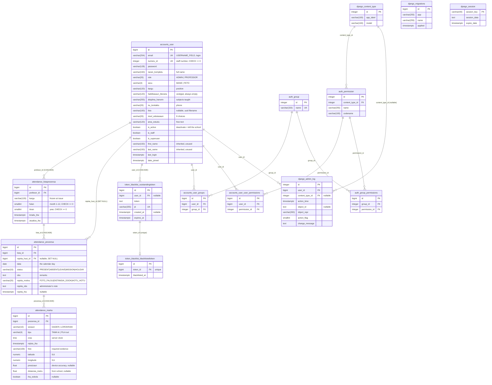

# ETI PREZENSA — Database Schema

Data dictionary and ERD for the **actual** PostgreSQL schema behind `eti-api`.

**Verified 2026-08-14** against three sources, in increasing order of authority:
`*/models.py`, every file in `*/migrations/`, and the live database
(`pg_class` / `pg_attribute` / `pg_constraint` on `eti_2026_db`). Where the
model and the database disagree, the database wins and the difference is noted.

**15 tables, 91 columns.** Six exist because of this project (four written
here, two auto-created by `AbstractUser`); nine come from Django and
`djangorestframework-simplejwt`.

---

## Scope note

**What this schema covers.** Attendance for **teaching and administrative
staff**, recorded as *punches*: a teacher presses Check in or Check out in the
mobile app, and the server stores the time, a photo taken at that moment, and
the device's GPS position. It is a digital replacement for one paper form —
*"LISTA PREZENSA BA PROFESÓR/A ETI DILI"* — and the table structure follows
that form: one sheet per teacher per month, one row per day, and now one extra
table for the punches that replaced the handwritten signatures.

**What it does not cover.** There is **no student table, no course, class,
lecture or session table, and nothing about grades or enrolment** anywhere in
the codebase. `User.role` has exactly two values, `ADMIN` and `PROFESSOR`, and
`ESTUDANTE` is not among them. Every account in this database is staff.

Also absent, and worth knowing before you go looking: no soft-delete columns
(removal is a real `DELETE`, cascading), no audit/history tables (the audit
trail is a log file, not a table), and no per-school or tenant column — this
schema serves one school.

### Language

Field and table names are **Tetun** and are kept exactly as they are. The
English meaning is in the Description column. A short glossary:

| Tetun | English | | Tetun | English |
|---|---|---|---|---|
| `naran kompletu` | full name | | `prezensa` | attendance / presence |
| `numeru` | number | | `marka` | a mark, here a punch |
| `kargu` | position, job title | | `oras` | time (of day) |
| `loron` | day | | `fulan` | month |
| `tinan` | year | | `dader` | morning |
| `lorokraik` | afternoon | | `tama` | to enter (check in) |
| `fila` | to return (check out) | | `sesaun` | session |
| `foto` | photo | | `iha eskola` | at the school |
| `rejistu` | recorded | | `kriadu` | created |
| `atualiza` | updated | | `disiplina hanorin` | subject taught |
| `nivel edukasaun` | education level | | `aréa estudu` | field of study |
| `sexu` | sex | | `nu. kontaktu` | contact number |
| `obs` | observation, remark | | `lista` | list, here a sheet |

### One thing to read before the tables

**Defaults in the `Default` column are enforced by Django, not by PostgreSQL.**
Apart from the identity `id` columns, not a single column in this database has
a DDL-level `DEFAULT`. A row written by anything other than Django — a raw
`INSERT` in pgAdmin, a restore from a partial dump — gets no default at all and
will fail the `NOT NULL` it was relying on. The same is true of every `choices`
list: they are validated in Python, and PostgreSQL will happily store
`status = 'BANANA'`. The only checks the database itself enforces are the three
`>= 0` checks on the unsigned integer columns, listed below.

---

## 1. `accounts_user`

Every person who can log in: teachers and administrators alike. It replaces
Django's default user — `username` is removed and `email` is the login field —
and its columns follow the school's published *"Dadus Professores"* roster
(NU., NARAN KOMPLETU, KARGU, HABILITASAUN LITERÁRIA, DISIPLINA HANORIN,
NU. KONTAKTU, FOTO, NIVEL EDUKASAUN, ARÉA ESTUDU), so a row here is the digital
version of a line on that page. The director keeps an account like anyone else
and signs the book like anyone else, which is why `ADMIN` accounts also own
attendance sheets.

| Field | Type | Null? | Default | Constraints | Description |
|---|---|---|---|---|---|
| `id` | `bigint` | NOT NULL | identity | **PK** | Surrogate key. Never shown to users — the number they know is `numeru_id`. |
| `password` | `varchar(128)` | NOT NULL | — | | Inherited from `AbstractUser`. PBKDF2 hash, never the password. |
| `last_login` | `timestamptz` | NULL | — | | Inherited. Written on each login (`UPDATE_LAST_LOGIN` is on in `SIMPLE_JWT`). |
| `is_superuser` | `boolean` | NOT NULL | `False` (Django) | | Inherited. Django-admin god mode; separate from `role`. |
| `first_name` | `varchar(150)` | NOT NULL | `''` (Django) | | Inherited and **unused** — this project stores the whole name in `naran_kompletu`. |
| `last_name` | `varchar(150)` | NOT NULL | `''` (Django) | | Inherited and **unused**, as above. |
| `is_staff` | `boolean` | NOT NULL | `False` (Django) | | Inherited. Grants Django admin, and counts as admin for the API: the `EhAdmin` permission is `is_staff` **OR** `role='ADMIN'`. |
| `is_active` | `boolean` | NOT NULL | `True` (Django) | | Whether the account still works. This is how a teacher *leaves*: deactivation keeps every sheet they ever filled, where a delete would take the history with it. Authentication refuses an inactive account immediately. |
| `date_joined` | `timestamptz` | NOT NULL | `now()` (Django) | | Inherited. When the account was created, not when the teacher was hired. |
| `email` | `varchar(254)` | NOT NULL | — | **unique** | `USERNAME_FIELD` — the login identifier. Matched **case-sensitively** at login, so the API rejects a new account whose address differs from an existing one only in case. |
| `naran_kompletu` | `varchar(150)` | NOT NULL | — | | NARAN KOMPLETU — full name, stored as one string because that is how the roster prints it. Backs `get_full_name()` and `__str__`. |
| `role` | `varchar(20)` | NOT NULL | `'PROFESSOR'` (Django) | choices: `ADMIN`, `PROFESSOR` | What the person is. Only two values exist; there is deliberately no student role. Widened to 20 chars in `accounts/0003`. |
| `sexu` | `varchar(4)` | NOT NULL | `''` (Django) | choices: `MANE`, `FETO`; blank allowed | Sex. `MANE` = male, `FETO` = female. Backs the male/female staff totals the school publishes. Blank, not NULL, when unknown. |
| `kargu` | `varchar(120)` | NOT NULL | `''` (Django) | | KARGU — position: *Diretor*, *Vice Diretor I*, *GAT*, *Chefe Dep. TLP*… Free text on purpose: the values vary too much to enumerate. Copied onto each sheet — see `attendance_listaprezensa.kargu`. |
| `habilitasaun_literaria` | `varchar(120)` | NOT NULL | `''` (Django) | | **Vestigial.** On the printed roster HABILITASAUN LITERÁRIA is a *heading* spanning `nivel_edukasaun` and `area_estudu`, not a column of its own. No serializer reads or writes it and it is always empty. Recorded as issue 15a for removal. |
| `disiplina_hanorin` | `varchar(255)` | NOT NULL | `''` (Django) | | DISIPLINA HANORIN — the subject(s) taught. One string, because a teacher may hold several and the roster lists them together. |
| `nu_kontaktu` | `varchar(20)` | NOT NULL | `''` (Django) | | NU. KONTAKTU — phone number. Text, not a number: leading zeros and `+670` matter. |
| `foto` | `varchar(100)` | **NULL** | `'fotos/default.jpg'` (Django) | | Path to the profile photo, relative to `MEDIA_ROOT`; the file itself is on disk. Stored under a **uuid** name (`fotos/<32 hex>.jpg`) because both clients upload the same filename every time and Django frees a name as soon as the old file is deleted — a recycled name meant a cached URL could resolve to a *different* teacher's face. Made nullable in `accounts/0004`; given the default in `accounts/0006`. The only field a teacher may change about themselves. |
| `nivel_edukasaun` | `varchar(20)` | NOT NULL | `''` (Django) | choices, 9 values; blank allowed | NIVEL EDUKASAUN — education level, low to high: `ENSINU_SEKUNDARIU`, `DIPLOMA`, `FINALISTA`, `UNIVERSITARIA`, `BACHARELATU`, `LICENCIADO`, `POST_GRADUACAO`, `MESTRADO`, `DOUTORAMENTU`. `FINALISTA` and `UNIVERSITARIA` were added in `accounts/0005` after the real roster turned out to contain staff those seven original values could not describe. |
| `area_estudu` | `varchar(120)` | NOT NULL | `''` (Django) | | ARÉA ESTUDU — field of study. Free text, not choices, and deliberately so: the school's own sheet spells the same area more than one way (*Engenharia Civil* / *Engenaria*, *Técnica Informática* / *Informatica*), and a closed list would reject a teacher whose area is simply new. The API serves a suggestion list (`AREA_ESTUDU_SUJERE`, 14 entries) so the form can offer without enforcing. |
| `numeru_id` | `integer` | NOT NULL | — | **unique**, `CHECK (numeru_id >= 0)` | NU. — the staff number that identifies the teacher on every list the school keeps, and the number a human uses to refer to them. Required and unique because it is issued by the school and never reused; it also leads every punch-photo filename so two teachers with similar names can never collide. Added in `accounts/0002`. A model-level `MinValueValidator(1)` forbids 0, but **the database only checks `>= 0`** — Django's check for `PositiveIntegerField` is unsigned, not non-zero. |

> **Composite uniqueness:** none. Two single-column unique constraints:
> `email` and `numeru_id`.

---

## 2. `attendance_listaprezensa`

One printed attendance sheet: **one teacher, one month**. This is the header
block of the paper form — whose sheet it is, their position, and which month —
and nothing else; the day-by-day grid is in `attendance_prezensa`. Rows are
created automatically, not by an administrator: the first punch of a month
calls `Prezensa.objects.ba_loron()`, which `get_or_create`s the sheet and then
the day.

| Field | Type | Null? | Default | Constraints | Description |
|---|---|---|---|---|---|
| `id` | `bigint` | NOT NULL | identity | **PK** | |
| `kargu` | `varchar(120)` | NOT NULL | `''` (Django) | | The teacher's position **frozen at the moment the sheet was issued**. This is the one field copied from `accounts_user` instead of read through the FK, and the duplication is the point: a promotion in August must not rewrite the title printed on February's sheet. Filled in `save()` from `profesor.kargu` if left blank — callers are not meant to set it. |
| `fulan` | `smallint` | NOT NULL | — | choices 1–12, `CHECK (fulan >= 0)` | FULAN — the month, as printed in the sheet header (*FULAN JULLU 2026*). Stored as a number with Tetun month labels supplied by Django. Note the DB check is only `>= 0`; `13` would be stored happily by a raw INSERT. |
| `tinan` | `smallint` | NOT NULL | — | `CHECK (tinan >= 0)` | TINAN — the year. Model validators bound it to 2000–2100; the database, again, only enforces `>= 0`. |
| `kriadu_iha` | `timestamptz` | NOT NULL | `auto_now_add` | | When the sheet was first opened — i.e. when this teacher first punched that month. |
| `atualiza_iha` | `timestamptz` | NOT NULL | `auto_now` | | Last write to the sheet row itself. |
| `profesor_id` | `bigint` | NOT NULL | — | **FK → `accounts_user(id)`**, `ON DELETE CASCADE` (Django) | Whose sheet this is. Deleting the teacher deletes every sheet, every day and every punch beneath it — which is why the delete endpoint demands the admin's password and the dashboard warns twice. |

> **Composite unique:** `(profesor_id, fulan, tinan)` —
> `unique_lista_prezensa_profesor_fulan_tinan`. One sheet per teacher per month,
> which is what makes `get_or_create` safe under two phones punching at once.

---

## 3. `attendance_prezensa`

One **day** on one sheet: a single row of the printed grid. What it does *not*
hold is the four times — ORAS DADER TAMA / FILA and ORAS LOROKRAIK TAMA / FILA
were columns on paper and were columns here too, until `attendance/0002`
removed them. They are now derived by reading the punches, because a time on
its own cannot carry the photo and GPS that replaced the signature. The
`oras_dader_tama` and similar names you see in API responses are **Python
properties, not columns** — do not go looking for them here.

| Field | Type | Null? | Default | Constraints | Description |
|---|---|---|---|---|---|
| `id` | `bigint` | NOT NULL | identity | **PK** | |
| `data` | `date` | NOT NULL | — | | DATA — the calendar day. Sundays never get a row: the printed sheet has no Sunday, and Saturday is a half day with no afternoon session. |
| `status` | `varchar(10)` | NOT NULL | `'PRESENT'` (Django) | choices: `PRESENT`, `ABSENT`, `LEAVE`, `MISSION`, `HOLIDAY` | What kind of day it was. **Stored values are English, labels shown to users are Tetun** (`Prezente`, `Falta`, `Lisensa`, `Misaun`, `Feriadu`) — the stored value is API contract, the label is for people. Any punch forces this to `PRESENT`; the other four are written by an administrator over a date range, and that endpoint refuses `PRESENT` because presence may only come from a punch. Renamed from `estadu` in `attendance/0003`, which also converted the stored Tetun values to English in a `RunPython`. |
| `obs` | `text` | NOT NULL | `''` (Django) | | OBS — the remarks column of the paper sheet. |
| `lista_id` | `bigint` | NOT NULL | — | **FK → `attendance_listaprezensa(id)`**, `ON DELETE CASCADE` (Django) | The monthly sheet this day belongs to. The teacher is reached through it — there is no direct teacher FK here. |
| `rejeita_motivu` | `varchar(20)` | NOT NULL | `''` (Django) | choices: `FOTO_FALSU`, `DISTANSIA_DOOK`, `HOTU_HOTU` | Why an administrator refused this day's evidence; `''` on a day nobody refused. `!!rejeita_motivu` is the one check that separates a rejected day from an ordinary absence, since both are `ABSENT`. **Renamed from `rejeisaun_motivu` in `attendance/0007`.** |
| `rejeita_obs` | `text` | NOT NULL | `''` (Django) | | The administrator's note about the refusal. Kept apart from `obs`, which is the printed OBS column and is not this feature's to overwrite. **Renamed from `rejeisaun_obs` in `attendance/0007`.** |
| `rejeita_husi_id` | `bigint` | NULL | — | **FK → `accounts_user(id)`**, `ON DELETE SET NULL` (Django) | Which administrator refused it. `SET NULL`, not cascade: the decision outlives the account that made it. |
| `rejeita_iha` | `timestamptz` | NULL | — | | When the refusal was recorded. Together with `rejeita_husi_id` this is the proof that `DELETE …/rejeita/` may restore the day — a `LEAVE` day written through `/status/` has neither, so it cannot be flipped to `PRESENT` through that door. |

> **Composite unique:** `(lista_id, data)` — `unique_prezensa_lista_data`.
> One row per day per sheet.
>
> **Rejection is a property of the day, not of a punch.** No `attendance_marka`
> column records it, and the punch rows are deliberately left untouched — they
> are the evidence the decision rests on. One consequence worth knowing before
> building UI: because the punch survives, the slot does **not** reopen, and a
> second punch for the same session is refused with `duplicate`. See
> `api-contract.md` §6, which records an open question about this.

> **Schema fingerprint:** the `NOT NULL` constraint on `status` is still named
> `attendance_prezensa_estadu_not_null`. PostgreSQL keeps the constraint's
> original name through a `RENAME COLUMN`, so the old Tetun name survives in
> the catalogue. Harmless, but it will confuse anyone reading `\d`.

---

## 4. `attendance_marka`

**One punch** — the moment a teacher pressed Check in or Check out, and the
evidence collected at that moment. This is the table the whole system exists
for: it is what replaced the handwritten signature. Nothing in it is editable
by the teacher; the time comes from the server clock and the coordinates from
the device.

A normal weekday produces up to four rows for one teacher: check in and check
out for the morning, the same again for the afternoon. Saturday allows only the
morning pair.

| Field | Type | Null? | Default | Constraints | Description |
|---|---|---|---|---|---|
| `id` | `bigint` | NOT NULL | identity | **PK** | |
| `sesaun` | `varchar(10)` | NOT NULL | — | choices: `DADER`, `LOROKRAIK` | Which half of the day. `DADER` = morning, `LOROKRAIK` = afternoon. Chosen from the clock — a punch at or after **13:00** (`LIMITE_SESAUN`) is afternoon — unless the client names a session explicitly, which lets a teacher close a session the clock has already moved past. |
| `tipu` | `varchar(4)` | NOT NULL | — | choices: `TAMA`, `FILA` | Direction. `TAMA` = arrival (check **in**), `FILA` = departure (check **out**). A `FILA` is refused if no `TAMA` exists for the same session. |
| `oras` | `time` | NOT NULL | — | | The time of the punch, from the **server** clock in Asia/Dili, not the device — a phone clock is the one thing a teacher could trivially change. Naive time; the date lives on the parent `Prezensa`. |
| `rejistu_iha` | `timestamptz` | NOT NULL | `auto_now_add` | | When the row was written. Distinct from `oras`, and worth keeping: a mismatch between them is evidence of something odd. |
| `foto` | `varchar(100)` | NOT NULL | — | | Path to the photo taken at the punch, relative to `MEDIA_ROOT`. **Required** — the punch is not valid without it. The name is deliberately readable: `prezensa/2026/08/punch_6_martinho-martins_checkin_2026-08-10_dader.jpg`, i.e. `punch_{numeru_id}_{slug(naran)}_{checkin\|checkout}_{date}_{sesaun}.ext`. `numeru_id` leads so two similar names never clash; `sesaun` closes it because a teacher checks in twice a day, so name + direction + date alone is **not** unique. Readable also means guessable — see the warning below. |
| `latitude` | `numeric(9,6)` | NOT NULL | — | model validators ±90 | Where the device said it was. Six decimals ≈ 11 cm, far finer than any phone GPS; the API **rounds** longer values from the device rather than rejecting the punch. |
| `longitude` | `numeric(9,6)` | NOT NULL | — | model validators ±180 | As above. Note `numeric(9,6)` leaves only three digits before the point, which is enough for a longitude up to ±180 but has no room to spare. |
| `presizaun` | `double precision` | NULL | — | | The accuracy radius the device reported, in metres. Recorded but **never trusted** for the geofence decision — the client controls it. |
| `distansia_metru` | `double precision` | NULL | — | | Distance from the school, computed by the Haversine formula in `attendance/geo.py` when the row is saved. Stored so that reviewing a month does not mean recomputing every row, and so the number that was used at the time survives a later change to the school's configured coordinates. |
| `iha_eskola` | `boolean` | NULL | — | | Whether the punch was inside the allowed radius. `NULL` when no school coordinates are configured — which must never block a teacher from punching. |
| `prezensa_id` | `bigint` | NOT NULL | — | **FK → `attendance_prezensa(id)`**, `ON DELETE CASCADE` (Django) | The day this punch belongs to. |

> **Composite unique:** `(prezensa_id, sesaun, tipu)` —
> `unique_marka_prezensa_sesaun_tipu`. One arrival and one departure per session
> per day. This is also what guarantees the readable filename above is unique,
> so no photo is ever overwritten.

> ⚠️ **Deployment note, not a schema fact.** Because the filenames are readable
> they are also predictable. `MEDIA_ROOT` must **not** be served publicly in
> production — anyone who saw one URL could otherwise walk to every other
> teacher's photo. Serve it privately and let clients fetch through
> `GET /api/marka/{id}/foto/`, which checks the token first. Django only serves
> `MEDIA_URL` itself when `DEBUG=True`.

---

## 5. `token_blacklist_outstandingtoken`

Written by `djangorestframework-simplejwt`, not by this project, but part of
this database. One row per refresh token ever issued — and with
`ROTATE_REFRESH_TOKENS` on, that means one per login **and one per refresh**,
so it grows steadily. Refresh tokens last 30 days and access tokens 15 minutes.

| Field | Type | Null? | Default | Constraints | Description |
|---|---|---|---|---|---|
| `id` | `bigint` | NOT NULL | identity | **PK** | |
| `token` | `text` | NOT NULL | — | | The encoded JWT itself. |
| `created_at` | `timestamptz` | **NULL** | — | | When it was issued. |
| `expires_at` | `timestamptz` | NOT NULL | — | | When it stops being accepted regardless of blacklisting. |
| `user_id` | `bigint` | **NULL** | — | **FK → `accounts_user(id)`**, `ON DELETE CASCADE` (Django) | Who it was issued to. Nullable in the upstream model. |
| `jti` | `varchar(255)` | NOT NULL | — | **unique** | The token's unique identifier claim. |

> **Growth warning:** nothing prunes this table. `flushexpiredtokens` is not
> scheduled anywhere, so both token tables grow for the life of the deployment.
> Recorded as issue 12.

---

## 6. `token_blacklist_blacklistedtoken`

The revocation list: a row here means the corresponding outstanding token is
refused. Rows appear on logout, on every rotation (`BLACKLIST_AFTER_ROTATION`),
and in bulk when a password is reset or changed — closing every other session
is the point of doing so.

| Field | Type | Null? | Default | Constraints | Description |
|---|---|---|---|---|---|
| `id` | `bigint` | NOT NULL | identity | **PK** | |
| `blacklisted_at` | `timestamptz` | NOT NULL | — | | When it was revoked. |
| `token_id` | `bigint` | NOT NULL | — | **FK → `token_blacklist_outstandingtoken(id)`**, **unique** | The token being revoked. Unique, so this is effectively **one-to-one** — a token can be blacklisted only once. |

---

## 7. `accounts_user_groups` and `accounts_user_user_permissions`

Created automatically by `AbstractUser`; this project does not use Django's
group or per-user permission system, so both are expected to be empty.
Authorisation is decided by `role` and `is_staff` instead.

| Table | Field | Type | Null? | Constraints |
|---|---|---|---|---|
| `accounts_user_groups` | `id` | `bigint` | NOT NULL | **PK** |
| | `user_id` | `bigint` | NOT NULL | **FK → `accounts_user(id)`** |
| | `group_id` | `integer` | NOT NULL | **FK → `auth_group(id)`** |
| | | | | **unique** `(user_id, group_id)` |
| `accounts_user_user_permissions` | `id` | `bigint` | NOT NULL | **PK** |
| | `user_id` | `bigint` | NOT NULL | **FK → `accounts_user(id)`** |
| | `permission_id` | `integer` | NOT NULL | **FK → `auth_permission(id)`** |
| | | | | **unique** `(user_id, permission_id)` |

---

## 8. Django framework tables

Standard, unmodified, and listed for completeness — every table in the database
is accounted for.

| Table | Columns | Purpose | Key constraints |
|---|---|---|---|
| `auth_group` | `id`, `name varchar(150)` | Permission groups. Unused here. | PK `id`; unique `name` |
| `auth_group_permissions` | `id`, `group_id`, `permission_id` | Group ↔ permission join. | FKs to `auth_group`, `auth_permission`; unique `(group_id, permission_id)` |
| `auth_permission` | `id`, `name varchar(255)`, `content_type_id`, `codename varchar(100)` | The auto-generated add/change/delete/view permissions. | FK to `django_content_type`; unique `(content_type_id, codename)` |
| `django_content_type` | `id`, `app_label varchar(100)`, `model varchar(100)` | Model registry. | unique `(app_label, model)` |
| `django_admin_log` | `id`, `action_time`, `object_id text NULL`, `object_repr varchar(200)`, `action_flag smallint`, `change_message text`, `content_type_id NULL`, `user_id` | What was changed through the Django admin **only**. API changes are not recorded here — those go to the application log file. | FK `user_id` → `accounts_user`; FK `content_type_id` → `django_content_type` |
| `django_migrations` | `id`, `app varchar(255)`, `name varchar(255)`, `applied` | Which migrations have run. | PK `id` |
| `django_session` | `session_key varchar(40)`, `session_data text`, `expire_date` | Django sessions. The API is stateless JWT; this serves `/admin/` only. | **PK is `session_key`**, not an `id` |

---

## Entity-Relationship Diagram

Real table names, real column names, all fifteen tables in one diagram.
Composite unique constraints are noted above each entity, since Mermaid ER has
no syntax for them.

---

## Migration history that shaped the current shape

Reading `models.py` alone would miss these; they are why some columns look the
way they do.

| Migration | Effect on the schema |
|---|---|
| `accounts/0002_user_numeru_id` | Added `numeru_id` unique, back-filling existing rows with `1`. |
| `accounts/0003_alter_user_role` | Widened `role` to `varchar(20)`. |
| `accounts/0004_alter_user_foto` | Made `foto` nullable and moved it to uuid filenames. |
| `accounts/0005_alter_user_nivel_edukasaun` | Added the `FINALISTA` and `UNIVERSITARIA` choices. Labels only — no stored value changed. |
| `accounts/0006_alter_user_foto` | Gave `foto` the `fotos/default.jpg` default. |
| `attendance/0002_remove_prezensa_foto_dader_fila_and_more` | **Dropped the four time columns and their photo columns from `Prezensa`.** This is the migration that turned times into punches. |
| `attendance/0003_rename_estadu_status` | Renamed `estadu` → `status` and converted the stored values from Tetun to English in a `RunPython` (reversible). Left the constraint name `..._estadu_not_null` behind. |
| `attendance/0004_alter_marka_foto` | Switched punch photos to the readable `punch_…` filenames. |
| `attendance/0005` · `0006` | Added the rejection fields (`rejeisaun_motivu`, `rejeisaun_obs`, `rejeita_husi`, `rejeita_iha`) and widened the reason choices. |
| `attendance/0007_rename_rejeisaun_motivu_…` | Renamed `rejeisaun_motivu` → `rejeita_motivu` and `rejeisaun_obs` → `rejeita_obs`, so all four rejection fields share one prefix. Two `RenameField` operations — `ALTER TABLE RENAME COLUMN`, no data moved. |

---

## Not part of the current schema — where a `Student` or `Lecture` would go

*Clearly labelled speculation. None of this exists in the codebase today, and
nothing above depends on it.*

Should the school ever want student attendance or timetabling, the shape of
what is already here suggests where it would attach:

- **A new Django app** (say `akademiku`) rather than more tables in
  `attendance/`, which is specific to the staff sheet and its four daily slots.
- **`Student`** would be its own model, not a third `User.role`. Students do
  not log in, have no `kargu` and no monthly staff sheet, and giving them a row
  in `accounts_user` would put them in every roster and report that currently
  filters on `role IN ('PROFESSOR', 'ADMIN')`.
- **`Lecture`** (a scheduled class session) would carry FKs to the teacher
  (`accounts_user`) and to a subject, and would be the natural place for a
  student attendance join table — `LectureAttendance(lecture, student, status)`.
- Today's `disiplina_hanorin` is **free text on the teacher**, not a relation.
  A real course model would replace it, and that migration would need to parse
  those strings.

The staff punch chain — `User → ListaPrezensa → Prezensa → Marka` — would be
untouched by any of it. Staff attendance and student attendance answer
different questions and should not share a table.
