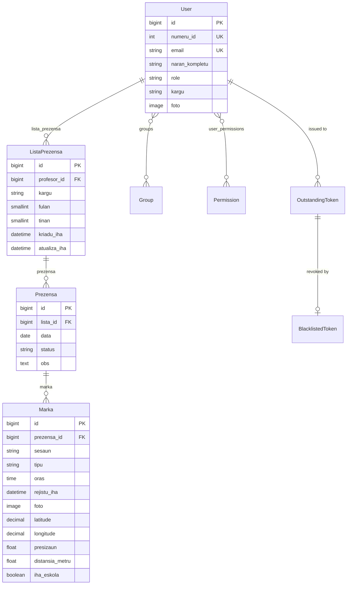

# ETI-Dili Attendance System — Project Context

Complete context for an AI coding agent. Everything here was read from source.
Anything not verifiable in code is marked **UNVERIFIED**.

Workspace root: `c:\workplace\eti-dili\` — **three** sibling git repositories:
`eti-api/` (backend), `eti-dashboard/` (Next.js admin web) and `eti-mobile/`
(Expo app). Paths below are relative to that root.

Last verified against the code: **2026-08-10** — 100 backend tests passing.

---

## 1. Project Overview

Digital replacement for the paper attendance book *"LISTA PREZENSA BA
PROFESÓR/A ETI DILI"* used by Escola Técnica de Informática Dili (ETI-Dili), a
technical school in Timor-Leste. Teachers clock in and out from a mobile app
four times a day (morning in/out, afternoon in/out); the handwritten signature
of the paper form is replaced by a photo taken at the punch plus GPS
coordinates, and the time is stamped by the server rather than written by hand.
Roles are `ADMIN` and `PROFESSOR` (`eti-api/accounts/models.py`): teachers punch,
ADMIN/staff gates the school-wide reports and the roster. Domain vocabulary and
all model/field names are Tetun.

Source of the teacher data model: <https://eti-dili.sch.tl/dadus-professores/>
(57 staff — 33 male, 24 female — at time of reading).

---

## 2. Tech Stack

### Backend — `eti-api/requirements.txt`

| Package | Version |
| --- | --- |
| Django | 6.0.7 |
| djangorestframework | 3.17.1 |
| djangorestframework_simplejwt | 5.5.1 |
| PyJWT | 2.13.0 |
| django-environ | 0.14.0 |
| psycopg | 3.3.4 |
| psycopg-binary | 3.3.4 |
| pillow | 12.3.0 |
| asgiref | 3.12.1 |
| sqlparse | 0.5.5 |
| tzdata | 2026.3 |

- Python **3.14** (interpreter path `C:\Python314` seen in tracebacks).
- Database: **PostgreSQL** (`DB_ENGINE` in `.env`, `psycopg` v3 driver).
- Virtualenv at `eti-dili/env/` and `eti-api/venv/` both exist — **UNVERIFIED**
  which one is canonical; the running interpreter resolved to `eti-dili/env/`.

### Mobile — `eti-mobile/package.json`

| Package | Version |
| --- | --- |
| expo | ~54.0.30 |
| react-native | 0.81.5 |
| react | 19.1.0 |
| expo-router | ~6.0.21 |
| typescript | ~5.9.2 |
| axios | ^1.13.2 |
| expo-secure-store | ~15.0.8 |
| expo-camera | ~17.0.10 |
| expo-image-picker | ~17.0.11 |
| expo-location | ~19.0.8 |
| expo-image | ~3.0.11 |
| expo-haptics | ~15.0.8 |
| @react-navigation/bottom-tabs | ^7.4.0 |
| react-native-reanimated | ~4.1.1 |
| react-native-safe-area-context | ~5.6.0 |
| @expo/vector-icons | ^15.0.3 |
| eslint / eslint-config-expo | ^9.25.0 / ~10.0.0 |

App identity (`eti-mobile/app.json`): name **ETI PRESENSA**, slug
`EtiPresenca`, scheme `etipresenca`, Android package
`com.juliao125.EtiPresenca`, new architecture enabled, typed routes + React
Compiler experiments on.

### Admin dashboard — `eti-dashboard/package.json`

| Package | Version |
| --- | --- |
| next | 16.3.0 |
| react / react-dom | 19.2.8 |
| tailwindcss | ^4 |
| typescript | ^5 |
| exceljs | ^4.4.0 |
| jspdf / jspdf-autotable | ^4.2.1 / ^5.0.8 |
| react-easy-crop | ^6.2.3 |
| react-loader-spinner | ^8.0.2 |

A Next.js 16 app (App Router, client components) with **six routes** and no
server-side data layer — every screen talks to `eti-api` over JWT. Exports are
generated in the browser, so the numbers on screen and in the file cannot
disagree.

**Django's own admin is a different thing and stays empty:** `/admin/` is
mounted, but `accounts/admin.py` and `attendance/admin.py` are untouched stubs,
so it lists only `Group` and the two simplejwt blacklist models. The
`eti-dashboard` app is what administrators actually use. See §10.

---

## 3. Repository Structure

```
eti-dili/                          three independent git repositories
│
├─ eti-api/                        Django REST backend  (68 commits)
│  ├─ core/                        settings (env-driven), URLconf, WSGI/ASGI
│  ├─ accounts/                    identity
│  │  ├─ models.py                 User (AUTH_USER_MODEL) + UserManager
│  │  │                            + foto_perfil / naran_foto_uniku upload paths
│  │  ├─ serializers.py            login, profile, photo, roster CRUD, reset-password
│  │  ├─ views.py                  LoginView, LogoutView, MeView, ProfesorViewSet
│  │  ├─ permissions.py            EhAdmin (is_staff or role=ADMIN)
│  │  ├─ urls.py                   /api/auth/* + the /api/profesor/ router
│  │  ├─ tests.py                  40 tests · tests_helpers.py  shared punch fixture
│  │  └─ migrations/               0001_initial · 0002_numeru_id
│  │                               0003_alter_user_role · 0004_alter_user_foto
│  ├─ attendance/                  the attendance book
│  │  ├─ models.py                 ListaPrezensa · Prezensa · Marka
│  │  │                            + calendar helpers, punch rules, foto_marka
│  │  ├─ serializers.py            punch in/out, istoria, reports, status writes
│  │  ├─ views.py                  PrezensaViewSet · ListaPrezensaViewSet · KonfigView
│  │  ├─ geo.py                    haversine distance + school geofence
│  │  ├─ tests.py                  60 tests
│  │  └─ migrations/               0001_initial · 0002_marka
│  │                               0003_rename_estadu_status · 0004_alter_marka_foto
│  ├─ docs/                        plan.md (this) · integrate-api.md · sql-query.md
│  │                               schema-overview.html · flow.png
│  │                               plan-delete-profesor.md · plan-reset-password.md
│  ├─ README.md                    public front page: what it does + REST reference
│  ├─ plan.md                      System Flow narrative (request lifecycle)
│  └─ .env                         secrets — never read values into docs
│
├─ eti-dashboard/                  Next.js 16 admin web  (163 commits)
│  ├─ app/
│  │  ├─ login/page.tsx            email + password
│  │  └─ (dashboard)/
│  │     ├─ layout.tsx             shell, session guard, profile refresh
│  │     ├─ page.tsx               Painel — today, whole school
│  │     ├─ profesor/page.tsx      roster CRUD, reset password, delete
│  │     ├─ prezensa/page.tsx      the grid + Rejistu Lisensa
│  │     ├─ relatoriu/page.tsx     summaries + Excel/PDF export
│  │     └─ konfig/page.tsx        schedule + geofence, read from /api/konfig/
│  ├─ components/                  Sidebar, Topbar, modals (Detalle, Evidensia,
│  │                               KortaFoto), ui/ primitives
│  └─ lib/                         api.ts (JWT, single-flight refresh, host swap)
│                                  auth.ts · store.ts · prezensa.ts · relatoriu.ts
│                                  periodu.ts · export-*.ts · korta-foto.ts
│
└─ eti-mobile/                     Expo / React Native  (62 commits)
   ├─ app/                         expo-router
   │  ├─ (auth)/index.tsx          login
   │  ├─ (eti)/index.tsx           Veranda — the two buttons
   │  ├─ (eti)/history.tsx         Istoria — monthly sheet
   │  ├─ (eti)/notification.tsx    Notifikasaun — mock data [WIP]
   │  ├─ (eti)/profile.tsx         Perfil + photo upload
   │  ├─ clock.tsx                 camera + GPS punch flow
   │  └─ announcement.tsx          hardcoded items [WIP]
   ├─ components/                  AttendanceCard, Istoria*, FulanPicker, …
   └─ lib/                         api.ts · auth.ts · storage.ts (SecureStore)
                                   prezensa.ts · istoria.ts · location.ts · config.ts
```

---

## 4. Features

### Backend — implemented

| Feature | Source |
| --- | --- |
| Custom user, email login, teacher fields from the school roster | `accounts/models.py` |
| Required unique staff number `numeru_id` | `accounts/models.py` |
| Profile photos get a uuid filename, so a URL is never recycled | `accounts/models.py` `naran_foto_uniku` |
| Punch photos get a readable filename: `punch_{numeru_id}_{naran}_{checkin\|checkout}_{data}_{sesaun}.ext` | `attendance/models.py` `foto_marka` |
| JWT login returning tokens **plus** the profile in one response | `accounts/serializers.py` |
| Logout via refresh-token blacklist | `accounts/views.py` |
| Refresh with rotation + blacklist-after-rotation | `core/settings.py` |
| `GET /api/auth/me/`; `PATCH` replaces the photo only, deleting the old file | `accounts/views.py`, `serializers.py` |
| Roster of **teachers and admins**, deactivated included | `accounts/views.py` `ProfesorViewSet` |
| Qualification fields on the roster: `nivel_edukasaun` (+display), `area_estudu`, `disiplina_hanorin`, readable and writable | `accounts/serializers.py` |
| Roster picklists served from `/api/konfig/`, so forms cannot drift from the model | `attendance/views.py` `KonfigView` |
| Create a teacher → one-time `password_inisial` | `accounts/views.py` |
| Soft (de)activation via `PATCH {is_active}` | `accounts/views.py` |
| Irreversible delete behind the admin's own password, cascading to sheets/days/punches **and photo files** | `accounts/views.py` `destroy` |
| Admin-set password reset (two matching fields) that revokes the teacher's sessions | `accounts/views.py` `reset_password` |
| Self-service password change for any signed-in account, old password required; the only route by which an ADMIN can change a password | `accounts/views.py` `TrokaPasswordView` |
| Rejecting a day's evidence — day becomes ABSENT carrying reason, note, who and when; punches deliberately kept | `attendance/views.py` `rejeita` |
| `eh_admin` / `rasik` guards on both destructive roster actions | `accounts/views.py` `_eh_admin` |
| Auto-opening monthly sheet + day row on first punch | `attendance/models.py` `PrezensaManager.ba_loron` |
| Check in / check out with photo + GPS evidence | `attendance/models.py` `checkin` / `checkout` / `_rejistu` |
| Session auto-detection at the 13:00 cut-off; `sesaun` override | `attendance/models.py`, `serializers.py` |
| Rules: no duplicate per session, no checkout before checkin, no Saturday afternoon | `attendance/models.py` |
| Geofence: refuse punches >100 m from school, distance in the error | `attendance/models.py`, `geo.py` |
| Geofence kill-switch `ESKOLA_OBRIGA_FATIN` | `core/settings.py` |
| Late detection (`atrazadu`) vs the scheduled column time | `attendance/models.py` `Marka.atrazadu` |
| Today's state + the two button flags (`bele_checkin` / `bele_checkout`) | `attendance/serializers.py` |
| Monthly/weekly history in the paper-sheet layout, `?profesor=` for admins | `attendance/views.py` `istoria` |
| School-wide daily report incl. who has not punched | `attendance/views.py` `ohin_hotu` |
| Any period × any/all staff, `?marka=false` light mode | `attendance/views.py` `hotu` |
| Hand-written LEAVE/MISSION/HOLIDAY/ABSENT over a range, atomic, refusing punched days | `attendance/views.py` `status` |
| Schedule + geofence settings exposed, without the coordinates | `attendance/views.py` `KonfigView` |
| GPS precision tolerance — the server rounds instead of rejecting | `attendance/serializers.py` `KoordenadaField` |
| Authorised photo download (owner or admin) streaming through the API | `attendance/views.py` `MarkaFotoView`, `models.py` `naran_foto_download` |
| **100 automated tests**, all passing (40 accounts + 60 attendance) | `*/tests.py` |

### Admin dashboard — implemented

| Feature | Source |
| --- | --- |
| Email login, admin-only (`role != ADMIN` is signed straight back out) | `app/login/page.tsx`, `app/(dashboard)/layout.tsx` |
| JWT in localStorage, single-flight rotating refresh, retry-once on 401 | `lib/api.ts` |
| Runtime host swap between the school's two LAN addresses | `lib/api.ts`, `components/ApiFallback.tsx` |
| Pre-paint session guard, cached profile refreshed once per load | `lib/auth.ts` `SESAUN_BOOT`, `(dashboard)/layout.tsx` |
| Painel — stat cards, "seidauk marka" list, newest-punch feed | `app/(dashboard)/page.tsx` |
| Prezensa grid — day/week/month, per-teacher, evidence modal | `app/(dashboard)/prezensa/page.tsx` |
| Rejistu Lisensa — write a status over a range, `iha_marka` conflicts surfaced | `app/(dashboard)/prezensa/page.tsx` |
| Profesór roster — create (one-time password card), edit, (de)activate | `app/(dashboard)/profesor/page.tsx` |
| Reset password (two matching fields) and delete (password + Tetun warning) | `app/(dashboard)/profesor/page.tsx` |
| Relatóriu — per-teacher summary, four stat cards, week/month/year | `app/(dashboard)/relatoriu/page.tsx`, `lib/relatoriu.ts` |
| Excel + PDF export generated in the browser | `lib/export-excel.ts`, `lib/export-pdf.ts` |
| Konfig panel reading the real schedule/geofence from the API | `app/(dashboard)/konfig/page.tsx` |
| Own profile photo upload with a cropper | `components/KortaFotoModal.tsx`, `lib/korta-foto.ts` |
| Light/dark + accent theme in localStorage | `lib/theme.ts` |

### Mobile — implemented

| Feature | Source |
| --- | --- |
| Login + session persistence in SecureStore | `app/(auth)/index.tsx`, `lib/storage.ts` |
| Single-flight token refresh, replay-once on 401, forced logout | `lib/api.ts` |
| Bottom tabs: Veranda / Istoria / Notifikasaun / Perfil | `app/(eti)/_layout.tsx` |
| Camera punch flow with GPS capture and Tetun permission prompts | `app/clock.tsx`, `lib/location.ts`, `app.json` |
| Monthly + weekly history UI, month picker, summary, day cards | `app/(eti)/history.tsx`, `components/Istoria*` |
| Profile view + photo replacement | `app/(eti)/profile.tsx`, `lib/auth.ts` |

### Unfinished

| Feature | Status |
| --- | --- |
| Mobile Notifikasaun tab | **[WIP]** `notificationsMock` hardcoded; no API exists |
| Mobile Announcements screen | **[WIP]** hardcoded `announcementItems`; no API exists |
| Django admin for reviewing punches/photos | **[WIP]** no project models registered — the dashboard covers this instead |
| Mobile "today" from the server | **[WIP]** `/api/prezensa/ohin/` exists; the app still caches locally (§10 #3) |
| Self-service password change | Not started — no route for anyone to change their own password |
| Monthly PDF of the sheet from the API | Not started (the dashboard exports client-side) |
| Scheduled `flushexpiredtokens` | Not scheduled on any host |

---

## 5. Database Schema



### `accounts.User` — `eti-api/accounts/models.py`

Every account: teachers, admins, later students. Extends `AbstractUser` with
`username = None` and email as `USERNAME_FIELD`; doubles as the teacher's
personnel record.

- Key fields: `numeru_id` (PositiveInteger, **unique, required**, min 1),
  `email` (unique), `naran_kompletu` (150), `role` (ADMIN/PROFESSOR, default
  PROFESSOR), `sexu` (MANE/FETO), `kargu` (120, free text),
  `disiplina_hanorin` (255), `nu_kontaktu`,
  `foto` (ImageField `fotos/`), `nivel_edukasaun` (choices), `area_estudu`.
- `REQUIRED_FIELDS = ['numeru_id', 'naran_kompletu']`; ordering by name.
- Relations: **one user has many monthly sheets** (`user.lista_prezensa`).
  Inherited M2M to `auth.Group` and `auth.Permission` (unused — gating is on
  `role`).
- Derived: `is_professor`, `get_full_name()`, `get_short_name()`.

### `attendance.ListaPrezensa` — `eti-api/attendance/models.py`

One printed sheet = one teacher for one month; holds the form's header block.

- Key fields: `profesor` (FK), `kargu` (snapshot), `fulan` (1–12 choices),
  `tinan` (2000–2100), `kriadu_iha`, `atualiza_iha`.
- Unique `(profesor, fulan, tinan)`.
- Relations: **belongs to one teacher** (`related_name='lista_prezensa'`,
  CASCADE); **has many day rows** (`lista.prezensa`).
- `kargu` is the only field copied from the user — deliberate, so a promotion
  does not rewrite the title on an already-signed sheet. Filled in `save()`.

### `attendance.Prezensa` — `eti-api/attendance/models.py`

One row of the grid: one teacher, one day. **Stores no times.**

- Key fields: `lista` (FK), `data` (Date), `status`
  (PRESENT/ABSENT/LEAVE/MISSION/HOLIDAY -- English values, Tetun display
  labels via `status_display`), `obs` (Text).
- Unique `(lista, data)`.
- Relations: **belongs to one sheet**; **has up to four punches**
  (`prezensa.marka`).
- Derived properties rebuild the printed grid: `loron` (weekday in Tetun),
  `sabadu`, `oras_dader_tama`, `oras_dader_fila`, `oras_lorokraik_tama`,
  `oras_lorokraik_fila`.
- Holds the business rules: `checkin()`, `checkout()`, `_rejistu()`,
  `sesaun_ba()`; constants `ORAS_*` (08:00/12:00/13:30/17:30) and
  `LIMITE_SESAUN = 13:00`.

### `attendance.Marka` — `eti-api/attendance/models.py`

One punch with its evidence — the replacement for the handwritten signature.

- Key fields: `prezensa` (FK), `sesaun` (DADER/LOROKRAIK), `tipu` (TAMA/FILA),
  `oras` (server-stamped), `rejistu_iha` (audit), `foto` (**required**,
  `prezensa/%Y/%m/`), `latitude`/`longitude` (Decimal 9,6, range-validated),
  `presizaun` (float, nullable), `distansia_metru` + `iha_eskola` (computed in
  `save()`).
- Unique `(prezensa, sesaun, tipu)` — the DB itself blocks a second punch in a
  session.
- Relations: **belongs to one day**; chain to a person is
  `Marka → Prezensa → ListaPrezensa → User`.
- Derived: `kolumna` (`ORAS_DADER_TAMA` …), `oras_orariu`, `atrazadu`
  (`None` for departures).

### Module-level helpers (`attendance/models.py`)

`Fulan` (IntegerChoices), `Sesaun`, `Tipu`, `LORON` map, `loron_servisu()`
(working days of a month, Sundays excluded), `semana_husi()` (week of month
from Monday), `data_ohin()` (single source of "today").

### Third-party tables

`rest_framework_simplejwt.token_blacklist` → `OutstandingToken` (FK to User)
and `BlacklistedToken` (1:1 to OutstandingToken). Plus Django defaults
(`auth_group`, `auth_permission`, `django_session`, `django_admin_log`,
`django_migrations`).

---

## 6. API Endpoints

Read from the live URL map (`core/urls.py`, `accounts/urls.py`,
`attendance/urls.py` via DRF routers) — **21 routes**, all verified against a
running server.

Global default: `IsAuthenticated` on everything
(`REST_FRAMEWORK.DEFAULT_PERMISSION_CLASSES`, `core/settings.py`).
All paths **require the trailing slash**.

| Method | Path | Purpose | Auth | Request → Response |
| --- | --- | --- | --- | --- |
| POST | `/api/auth/login/` | Obtain tokens + profile | No | `{email, password}` → `{access, refresh, user{...}}`; 401 on bad credentials |
| POST | `/api/auth/refresh/` | Rotate tokens | No | `{refresh}` → `{access, refresh}`; old refresh blacklisted |
| POST | `/api/auth/verify/` | Check a token | No | `{token}` → `{}` / 401 |
| POST | `/api/auth/logout/` | Blacklist refresh token | Yes | `{refresh}` → 205 `{detail}`; 400 `{code: token_not_valid}` |
| GET | `/api/auth/me/` | Own profile | Yes | → `{id, numeru_id, email, naran_kompletu, kargu, foto, role, role_display}` |
| PATCH | `/api/auth/me/` | Replace profile photo | Yes | multipart `foto` (required) → full profile. Other fields ignored. `PUT` → 405 |
| POST | `/api/auth/troka-password/` | Change **your own** password | Yes | `{password_tuan, password_foun, password_konfirma}` → `{detail, sesaun_taka, access, refresh}`. Revokes every other session; 403 `password_tuan_sala`, 400 `password_la_hanesan` / `password_hanesan_tuan` / `password_fraku` |
| GET | `/api/prezensa/` | List own day rows | Yes | → `PrezensaSerializer[]` scoped to `request.user` |
| GET | `/api/prezensa/{id}/` | One day row | Yes | → `PrezensaSerializer` |
| GET | `/api/prezensa/ohin/` | Today + button state (creates row) | Yes | → day (`status`, `status_display`, …) + `sesaun`, `oras_tama`, `oras_fila`, `bele_checkin`, `bele_checkout`, `marka[]` |
| GET | `/api/prezensa/istoria/` | One month (or week) of a sheet, paper-layout | Yes | `?fulan&tinan&semana` → `{profesor, kargu, fulan, fulan_display, tinan, semana, rezumu{...}, loron[]}`; `?profesor=<id>` (admin only) opens another teacher's sheet; 400 `invalid_period` |
| GET | `/api/prezensa/ohin-hotu/` | Today for **all** teachers | Yes + **EhAdmin** | → `{data, loron, rezumu{total, marka_ona, seidauk_marka}, profesor[]}`; 403 otherwise |
| POST | `/api/prezensa/checkin/` | Arrival punch | Yes | multipart `foto`,`latitude`,`longitude`,`presizaun?`,`sesaun?` → 201 day + `marka_foun` |
| POST | `/api/prezensa/checkout/` | Departure punch | Yes | same → 201 |
| GET | `/api/prezensa/hotu/` | Any teacher over a period (dashboard grid) | Yes + **EhAdmin** | `?data=YYYY-MM-DD` or `?fulan&tinan&semana?` + `?profesor?` + `?marka=false?` → one line per teacher per working day, empty days included |
| POST | `/api/prezensa/status/` | Hand-write LEAVE/MISSION/HOLIDAY/ABSENT over a range | Yes + **EhAdmin** | `{profesor, status, husi, too, obs?}` → 201 with the days written; Sundays skipped; punched days block all with 400 `iha_marka` |
| DELETE | `/api/prezensa/status/` | Return a hand-written day to "no record" | Yes + **EhAdmin** | `{profesor, data}` → 204; 400 `iha_marka` if punched or PRESENT |
| GET | `/api/profesor/` | Roster: **PROFESSOR + ADMIN**, incl. deactivated | Yes + **EhAdmin** | → roster rows (`role`, `role_display`, `sexu`, `nu_kontaktu`, `is_active` on top of the profile) |
| POST | `/api/profesor/` | Create teacher account | Yes + **EhAdmin** | → 201 roster row + `password_inisial` (shown once); 400 `duplicate_numeru` / `duplicate_email` |
| PATCH | `/api/profesor/{id}/` | Update / soft-(de)activate | Yes + **EhAdmin** | any subset + `is_active` → roster row; `PUT` → 405 |
| DELETE | `/api/profesor/{id}/` | **Irreversible** delete: teacher + all sheets/days/punches + photo files | Yes + **EhAdmin** | `{password}` (the caller's own) → 204; 400 `password_presiza`, 403 `password_sala` / `rasik` / `eh_admin` |
| POST | `/api/profesor/{id}/reset-password/` | Admin sets a new password for a teacher who lost theirs; revokes their open sessions | Yes + **EhAdmin** | `{password_foun, password_konfirma}` (must match) → 200 `{detail, sesaun_taka, profesor}`; 400 `password_presiza` / `password_la_hanesan` / `password_fraku`, 403 `eh_admin` / `rasik` |
| GET | `/api/marka/{id}/foto/` | Download one punch photo under a readable name | Yes (owner **or** EhAdmin) | → the file with `Content-Disposition: attachment; filename="punch_<naran>_<checkin\|checkout>_<data>_<sesaun>.jpg"`; 403 `la_iha_permisaun`, 404 `foto_lakon` |
| GET | `/api/konfig/` | Scheduled times + geofence settings | Yes | → `oras_*`, `limite_sesaun`, `eskola_raiu_metru`, `eskola_obriga_fatin`; **no coordinates** |
| GET | `/api/lista-prezensa/` | Own monthly sheets | Yes | → `ListaPrezensaSerializer[]` with nested days |
| GET | `/api/lista-prezensa/{id}/` | One monthly sheet | Yes | → sheet + `prezensa[]` |
| GET | `/api/` | DRF browsable API root | Yes | Router-generated index |
| — | `/admin/` | Django admin | Session | No project models registered |
| — | `/media/*` | Uploaded photos | No | Served **only when `DEBUG=True`** (`core/urls.py`) |

### Punch error codes (400, `{detail, code, …}`)

| code | Meaning | Extra |
| --- | --- | --- |
| `duplicate` | Already punched this session | `oras` |
| `no_checkin` | Checkout before checkin | — |
| `no_session` | Saturday afternoon | — |
| `dook_husi_eskola` | Beyond the geofence radius | `distansia` (m) |
| `invalid_period` | Bad `fulan`/`tinan`/`semana` | — |
| `token_not_valid` | Expired/blacklisted token | — |

### Roster error codes

| code | Meaning |
| --- | --- |
| `duplicate_numeru` / `duplicate_email` | The column is taken |
| `password_presiza` / `password_sala` | DELETE: the caller's password is missing or wrong |
| `password_la_hanesan` / `password_fraku` | reset-password: the two fields differ, or Django's validators refused it (`erros[]`) |
| `rasik` | The target is the caller |
| `eh_admin` | The target is an ADMIN — not deletable or resettable from the roster |

---

## 7. Auth & Permissions

Config: `eti-api/core/settings.py` (`SIMPLE_JWT`, `REST_FRAMEWORK`).

| Setting | Value |
| --- | --- |
| `ACCESS_TOKEN_LIFETIME` | 15 minutes |
| `REFRESH_TOKEN_LIFETIME` | 30 days |
| `ROTATE_REFRESH_TOKENS` | True |
| `BLACKLIST_AFTER_ROTATION` | True |
| `UPDATE_LAST_LOGIN` | True |
| Auth class | `rest_framework_simplejwt.authentication.JWTAuthentication` |
| Default permission | `IsAuthenticated` |

### Flow

1. **Login** — `LoginSerializer` (extends `TokenObtainPairSerializer`)
   authenticates by **email**, signs HS256 tokens with `SECRET_KEY`, embeds
   `naran_kompletu` and `role` as custom claims, and attaches the serialized
   user so the app draws its header without a second call.
2. **Validation** — `JWTAuthentication` verifies signature and `exp` on each
   request; stateless, no DB lookup of the token.
3. **Refresh** — returns a new access **and** refresh token, blacklisting the
   used one. Because rotation resets the lifetime, `REFRESH_TOKEN_LIFETIME` is
   effectively an **idle timeout**.
4. **Logout** — blacklists the refresh token (205). The already-issued access
   token stays valid until it expires (≤15 min) — inherent to stateless JWT,
   documented in `eti-api/plan.md`.

### Roles & route protection

| Route group | Protection |
| --- | --- |
| `/api/auth/login|refresh|verify/` | Public |
| Everything else under `/api/` | `IsAuthenticated` (global default) |
| `/api/prezensa/ohin-hotu/`, `hotu/`, `status/`, all of `/api/profesor/` | `IsAuthenticated` + `EhAdmin` (`accounts/permissions.py`: `is_staff` **or** `role == ADMIN`) |
| `/api/prezensa/istoria/?profesor=` | `EhAdmin` for somebody else's sheet; without the param it is your own |
| `/api/profesor/{id}/` DELETE and `reset-password/` | additionally refuse an ADMIN target (`eh_admin`) and the caller's own account (`rasik`) |
| All other attendance routes | Scoped by queryset to `request.user` — a teacher cannot read another's data even by guessing an id |
| `/admin/` | Django session auth, staff only. No project models registered |

### Client side

Both clients implement the same discipline — single-flight refresh, retry once
on 401, then force re-login — and differ only in where they keep the tokens.

**`eti-mobile/lib/`**

- Tokens and cached profile in **expo-secure-store** (`storage.ts`):
  `access_token`, `refresh_token`, `user_profile`; legacy `auth_token` cleared.
- `api.ts`: the request interceptor attaches the Bearer token and mints one
  pre-emptively if absent; the response interceptor refreshes once on 401,
  replays, else `forceLogin()`.
- `PUBLIC_PATHS` (login/refresh/verify) never carry a token and are never
  retried.
- Multipart: `Content-Type` is set to `false` so React Native attaches its own
  boundary — documented at length in `lib/api.ts`.

**`eti-dashboard/lib/`**

- Tokens in **localStorage** (`eti.access`, `eti.refresh`) plus a cached
  profile (`eti.perfil`), so the sidebar paints before `/auth/me/` answers.
  The layout re-fetches the profile once per document load, or a replaced photo
  URL would stay stale.
- `SESAUN_BOOT` runs before paint: a visitor without a token never sees a frame.
- `apiBase()` resolves a runtime override → `NEXT_PUBLIC_API_URL` → port 8000 of
  the serving host, so one build works on both school LANs; a failed connection
  raises `API_SEM_LIGASAUN` and the shell offers the other host.
- A non-ADMIN session is signed out on sight — every admin route would 403.

---

## 8. Conventions

### Naming

| Convention | Example |
| --- | --- |
| Domain names in **Tetun**, on models, fields, serializers, actions | `Prezensa`, `Marka`, `naran_kompletu`, `oras_dader_tama`, `ba_loron()` |
| Framework/infra names in English | `LoginView`, `get_queryset`, `related_name` |
| Model verbose names wrapped in `gettext_lazy as _` | all fields in both apps |
| Choices as nested `TextChoices`/`IntegerChoices` | `User.Role`, `Prezensa.Status`, `Fulan` |
| DB constraints named explicitly | `unique_marka_prezensa_sesaun_tipu` |
| URL segments kebab-case, resource-first | `/api/prezensa/ohin-hotu/` |
| React components PascalCase, `lib/` modules lowercase | `IstoriaDayCard.tsx`, `lib/istoria.ts` |
| TS types mirror API field names exactly (Tetun preserved) | `LoronRecord`, `Rezumu`, `Kolumna` |

### Code organisation

- **Business rules live on the model**, not the view: `Prezensa._rejistu()`
  owns every punch rule; views only validate, delegate, serialize.
- **Managers own creation**: `Prezensa.objects.ba_loron()` is the only path
  that creates a sheet or a day row.
- **Derived data is a property, never a column** — `loron`, `oras_*`,
  `kolumna`, `atrazadu`; storing them would let them disagree with their source.
- **One source of truth for "today"**: `data_ohin()` in
  `attendance/models.py`, used by both views and managers.
- Read serializers are fully `read_only_fields`; a separate serializer handles
  each write (`MarkaPrezensaSerializer`, `FotoSerializer`).
- Custom DRF field for lenient input: `KoordenadaField` rounds GPS precision
  instead of rejecting it.
- Mobile keeps **all network/state code in `lib/`**; screens in `app/` are
  presentation + local state only.

### Comment style

Comments explain **why**, not what — e.g. why `kargu` is denormalized, why
`partial=True` is not used on the photo PATCH, why `Content-Type` is set to
`false` in the axios interceptor. Follow this when editing.

### Testing

- Django `TestCase`/`APITestCase`, no pytest. **100 tests** (40 accounts,
  60 attendance). Run with `--noinput` so a leftover test database from an
  interrupted run does not stop at a prompt.
- Media isolated per test class via `override_settings(MEDIA_ROOT=tempfile…)`.
- Time-sensitive API tests **pin the clock** by patching
  `attendance.models.timezone` and `attendance.serializers.timezone`
  (`attendance/tests.py` `oras_ohin`), so a Saturday-afternoon run cannot fail
  spuriously.
- Geofence tests pin `ESKOLA_OBRIGA_FATIN=True` with `override_settings`
  because the local `.env` disables it.
- Probes against the real database run inside `transaction.atomic()` with
  `set_rollback(True)`, and with `override_settings(MEDIA_ROOT=tempfile…)` when
  they write files — production rows and photos are never touched.
- No frontend tests exist in either client; `tsc --noEmit` and `lint` are the
  only gates. **[WIP]**

---

## 9. How to Run

### Backend — from `eti-api/`

```bash
pip install -r requirements.txt
python manage.py migrate
python manage.py createsuperuser        # prompts email, numeru_id, naran_kompletu
python manage.py runserver 0.0.0.0:8000 # 0.0.0.0 so phones on the LAN can reach it
python manage.py test --noinput         # 100 tests, ~7 min
python manage.py flushexpiredtokens     # housekeeping, weekly
```

`.env` keys at `eti-api/.env` (**names only**):

| Variable | Purpose |
| --- | --- |
| `SECRET_KEY`, `DEBUG`, `ALLOWED_HOSTS` | Django basics |
| `DB_ENGINE`, `DB_NAME`, `DB_USER`, `DB_PASSWORD`, `DB_HOST`, `DB_PORT` | PostgreSQL |
| `ESKOLA_LATITUDE`, `ESKOLA_LONGITUDE` | School position (defaults `-8.552336, 125.541603`) |
| `ESKOLA_RAIU_METRU` | Geofence radius (default 100.0) |
| `ESKOLA_OBRIGA_FATIN` | Enforce the geofence (default True) |

Loaded by `environ.Env.read_env(BASE_DIR / '.env')` in `core/settings.py`,
which must run before any `env()` call. A template lives in `.env.example`.

### Admin dashboard — from `eti-dashboard/`

```bash
npm install
npm run dev            # http://localhost:3000
npm run build && npm start
npm run lint
npx tsc --noEmit       # no test suite yet
```

| Variable | Purpose |
| --- | --- |
| `NEXT_PUBLIC_API_URL` | API base **including** `/api`, no trailing slash. Unset, the app assumes port 8000 of whatever host serves it |

### Mobile — from `eti-mobile/`

```bash
npm install
npx expo start         # or: npm run android | npm run ios | npm run web
npm run lint
npx tsc --noEmit
```

| Variable | Purpose |
| --- | --- |
| `EXPO_PUBLIC_API_URL` | Backend base URL; falls back to a hardcoded LAN IP in `lib/config.ts` |

Device and server must share a network.

### Backup

`pg_dump` is not on PATH; it lives at `C:\Program Files\PostgreSQL8in`.
The exact, tested command and its restore are in
**[sql-query.md §7](sql-query.md)**. Remember the database alone is not a
complete backup — `MEDIA_ROOT` holds the photos the rows point at.

### Pre-production checklist

`DEBUG=False` · real `SECRET_KEY` and `ALLOWED_HOSTS` · TLS ·
`ESKOLA_OBRIGA_FATIN=True` · the web server serving `MEDIA_ROOT` (the `/media/`
route is DEBUG-only) · `flushexpiredtokens` on a weekly schedule.

---

## 10. Known Issues / TODOs

No `TODO`/`FIXME` comments exist in any of the three codebases. Everything
below was found by reading the code on **2026-08-10**.

### Open — mobile ⇄ backend drift

| # | Issue | Location |
| --- | --- | --- |
| 1 | **Session boundary disagrees.** The app splits morning/afternoon at **13:30**; the server uses **13:00** (`LIMITE_SESAUN`). A punch between the two is filed by the server in the afternoon while the app labels it morning. Fix: read `limite_sesaun` from `GET /api/konfig/` instead of hardcoding. | `eti-mobile/lib/prezensa.ts:40` |
| 2 | `PREZENSA_ENDPOINTS.istoriaOhin` still points at `/api/prezensa/istoria-ohin/`, which no longer exists. Dead constant; a 404 if ever used. | `eti-mobile/lib/config.ts:47` |
| 3 | "Today" is cached in SecureStore instead of read from `/api/prezensa/ohin/`, which exists and is authoritative. The cache can drift from the server. | `eti-mobile/lib/prezensa.ts` |
| 4 | The punch form sends a `periodu` field the API neither accepts nor reads — the server derives the column. Harmless but misleading. | `eti-mobile/lib/prezensa.ts:51` |
| 5 | Error `code`s are not handled — only generic messages. In particular **`duplicate` should be treated as success**: the punch *was* recorded, so a dropped response shows a false failure. | `eti-mobile/lib/api.ts` |
| 6 | `presizaun` (GPS accuracy) is never sent, so the column is always null. | `eti-mobile/lib/prezensa.ts` |
| 7 | Notifikasaun and Announcements are hardcoded mock data; no API exists for either. | `app/(eti)/notification.tsx`, `app/announcement.tsx` |

### Open — backend / operations

| # | Issue |
| --- | --- |
| 8 | **No project models in Django admin** — the stubs are empty. Acceptable now that `eti-dashboard` covers review, but there is no fallback if the dashboard is down. |
| 9 | `ESKOLA_OBRIGA_FATIN=False` is set in `eti-api/.env` for testing — **the geofence is currently disabled**; punches from anywhere are accepted. Must be `True` before real use. |
| 10 | `SECRET_KEY` still carries the `django-insecure-` prefix and `ALLOWED_HOSTS=*`. **Both are go-live tasks, not casual ones:** rotating the key invalidates every issued JWT, logging every teacher out once. The rest of the deployment hardening (HSTS, SSL redirect, secure cookies, nosniff, DENY framing) is now applied automatically whenever `DEBUG=False` — see `core/settings.py`. |
| 10a | ~~`requirements.txt` cannot build a working project~~ **Resolved 2026-08-13:** `django-cors-headers` was in `INSTALLED_APPS` and `MIDDLEWARE` but missing from the pins, so a clean install came up dead. Now pinned at 4.9.0. |
| 10b | No pagination anywhere. `/api/profesor/` returns every account as a bare array and `/api/prezensa/hotu/` over a month is roughly *teachers × working days* rows (≈1,480 at 57 staff) with punches nested. Adding DRF pagination globally would wrap every list in `{count, results}` and break both clients, so it needs an opt-in design. |
| 11a | **Punch photo paths are guessable by design** (`punch_6_martinho-martins_checkin_2026-08-10_dader.jpg`) and `MEDIA_ROOT` is served without auth. Serve `MEDIA_ROOT` privately in production and route photo access through `GET /api/marka/{id}/foto/`, or anyone with one URL can enumerate the rest. |
| 11 | No size or dimension limit on uploads. A phone sends 3–8 MB per punch, ~4 punches/day/teacher, and nothing downscales them. |
| 12 | Blacklist tables grow ~1 row per refresh; `flushexpiredtokens` is not scheduled anywhere. |
| 13 | Logout cannot revoke an already-issued access token (≤15 min window) — inherent to stateless JWT, not a defect. |
| 14 | ~~No self-service password change~~ **Resolved 2026-08-12:** `POST /api/auth/troka-password/` lets any signed-in account change its own password with the old one, and is the only route by which an ADMIN can change a password. |
| 15 | No frontend tests in either client; `tsc --noEmit` and `lint` are the only gates. |
| 18 | **Rejection does not reopen the slot.** The punch rows survive a rejection by design, so a second punch for the same session is refused with `duplicate`. The feature is sometimes described as soft-invalidating the punch and letting the teacher punch again — the code does neither. Open question recorded in `docs/api-contract.md` §6. |
| 19 | `_status_rejistu` writes `status` **and** `obs` over a whole date range and **logs nothing**, unlike the rejection handlers. A punch landing later on such a day resets `status` to PRESENT but leaves `obs` behind, so a fully attended day can carry a leave note. Observed on numeru_id 112, 2026-08-11 and 08-12. |
| 15a | `User.habilitasaun_literaria` is **vestigial**: on the published roster HABILITASAUN LITERÁRIA is a heading over `nivel_edukasaun` + `area_estudu`, not a column. It is exposed nowhere and always empty — a candidate for removal. |
| 16 | ~~Two virtualenvs, unverified which is canonical~~ **Settled 2026-08-13:** `eti-api/venv/` is canonical — Python 3.14.3, and it matches every pin in `requirements.txt` exactly. `eti-dili/env/` **does not exist** (no interpreter); the earlier note was wrong. Beware a third environment: a bare `python` on PATH resolves to `C:\Python314` with user site-packages, carrying Django 6.0.3, DRF 3.16.1 and **psycopg2** instead of the pinned 6.0.7 / 3.17.1 / psycopg 3 — tests pass there too, but it is not what the project declares. Always run through `eti-api/venv/Scripts/python.exe`. |
| 17 | `eti-api/plan.md` (System Flow) overlaps this document. Kept because it explains the request lifecycle in prose; keep both in sync or fold one in. |

### Resolved — kept as a record of decisions

| Date | Change |
| --- | --- |
| 2026-08-06 | `Prezensa.estadu` → `status`, values → English (`PRESENT`/`ABSENT`/`LEAVE`/`MISSION`/`HOLIDAY`), endpoint `/prezensa/estadu/` → `/prezensa/status/`. Migration `attendance/0003` maps existing rows; `status_display` keeps the Tetun label. |
| 2026-08-06 | Admins now appear in every report (`profesores_relatoriu`), so the director keeps a sheet like everyone else. |
| 2026-08-07 | The roster lists ADMIN accounts too. Because they are no longer hidden by the queryset, DELETE and reset-password gained an explicit `eh_admin` guard. |
| 2026-08-07 | `DELETE /api/profesor/{id}/` (admin password required) and `POST /api/profesor/{id}/reset-password/` added. |
| 2026-08-08 | `ESTUDANTE` removed from `User.Role` (migration `accounts/0003`). |
| 2026-08-09 | **Photo filenames are now uuids** (`accounts/0004`, `attendance/0004`). Clients always upload the same name and replacing a photo deletes the old file, which freed the name for the next upload — a cached URL could 404 or resolve to a *different* teacher's photo. |
| 2026-08-09 | The dashboard refreshes its cached profile once per load, so a replaced photo URL cannot stay stale. |
| 2026-08-10 | `Prezensa.clock_in()` / `clock_out()` → **`checkin()` / `checkout()`**; API fields `bele_clock_in`/`bele_clock_out` → `bele_checkin`/`bele_checkout`; error code `no_clock_in` → `no_checkin`. URLs were already `/checkin/` and `/checkout/`. No schema change. |

---

## Tetun glossary

`prezensa` attendance · `marka` punch · `lista prezensa` attendance sheet ·
`profesor` teacher · `naran kompletu` full name · `kargu` position ·
`foto` photo · `oras` time · `loron` day/weekday · `fulan` month ·
`tinan` year · `semana` week · `dader` morning · `lorokraik` afternoon ·
`tama` in/enter · `fila` out/return · `atrazadu` late ·
`iha eskola` at school · `dook` far · `rezumu` summary · `seidauk` not yet ·
`eskola` school · `raiu` radius · `distansia` distance · `presizaun` accuracy ·
`sesaun` session · `tipu` type · `numeru` number · `sexu` sex ·
`bele` can/allowed · `hotu` all · `ohin` today · `istoria` history
